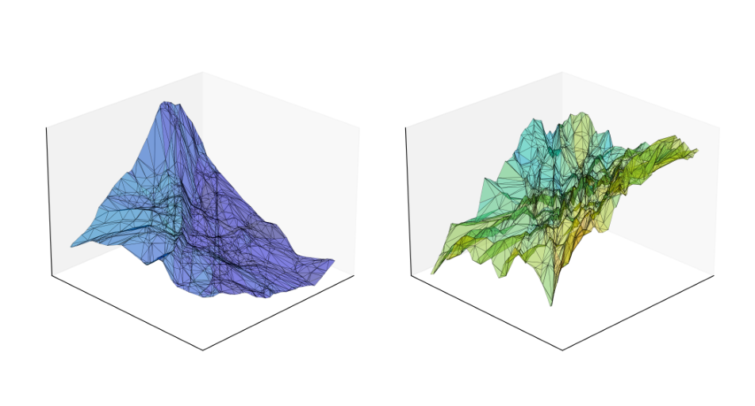
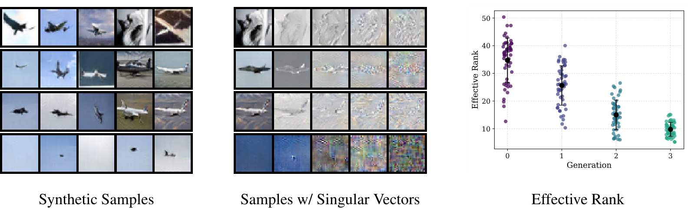

# A Geometric Perspective on Recursive Synthetic Training

Patrick Batsell, Thomas Walker, Richard Baraniuk (Rice University)

2nd DeLTa Workshop, ICLR 2026. [[paper]](paper/A_Geometric_Perspective_on_Recursive_Synthetic_Training.pdf)

## Summary

Training generative models on their own outputs degrades sample quality and collapses diversity (Model Autophagy Disorder, or MADness). This paper looks at that degradation through the local geometry of the generator: the input-output Jacobians of the deep generative network, evaluated at sampled latent vectors. Across generations of self-training, the singular value spectra of these Jacobians concentrate on a few directions, so their effective rank drops, and the left singular vectors become noisy at increasingly low orders. The generator also becomes an increasingly jagged, high-Lipschitz map. Together these explain both symptoms of MADness, mode collapse and visible artifacts, and they show up before the drop in FID.

<p align="center">
  
</p>
<p align="center"><em>The piecewise-affine map of a VAE generator trained on a 2-D circle, at generation 0 (left) and after two rounds of synthetic retraining (right).</em></p>

<p align="center">
  
</p>
<p align="center"><em>BigGAN on CIFAR-10 in a synthetic loop: samples ordered by the effective rank of their Jacobian, the same samples with four of their singular vectors, and effective rank across generations.</em></p>

Experiments cover a VAE on a 2-D circle, conditional GANs on MNIST and FashionMNIST in fully synthetic and partially real loops, BigGAN on CIFAR-10, and a VAE on a 5-D Gaussian for the NEON experiments.

## Contents

- `FullSynthetic/` MNIST and FashionMNIST GAN synthetic loops
- `AugmentedSynthetic/` real + synthetic mixing loops
- `NeonTest/` NEON with spectrum-collapsed synthetic data (VAE notebook and MNIST GAN script)
- `FineTuning/` NEON fine-tuning on the MNIST GAN and a DDIM
- `docs/` experiment details

The 2-D VAE and BigGAN CIFAR-10 experiments are not included.

## Setup

```bash
pip install -r requirements.txt
```

MNIST and FashionMNIST download automatically.

## Running

```bash
python FullSynthetic/GAN-MNIST/GAN-MNIST-Default/main.py
python FullSynthetic/GAN-MNIST/GAN-MNIST-Default/jacobian_gan_multi_avg.py
python FullSynthetic/GAN-MNIST/GAN-MNIST-Default/compute_fid.py
python NeonTest/ThomasExample/neon_controlled_collapse_gan.py
```

## Citation

```bibtex
@inproceedings{batsell2026geometric,
  title     = {A Geometric Perspective on Recursive Synthetic Training},
  author    = {Batsell, Patrick and Walker, Thomas and Baraniuk, Richard},
  booktitle = {2nd Workshop on Deep Learning Theory and Applications (DeLTa), ICLR},
  year      = {2026}
}
```
